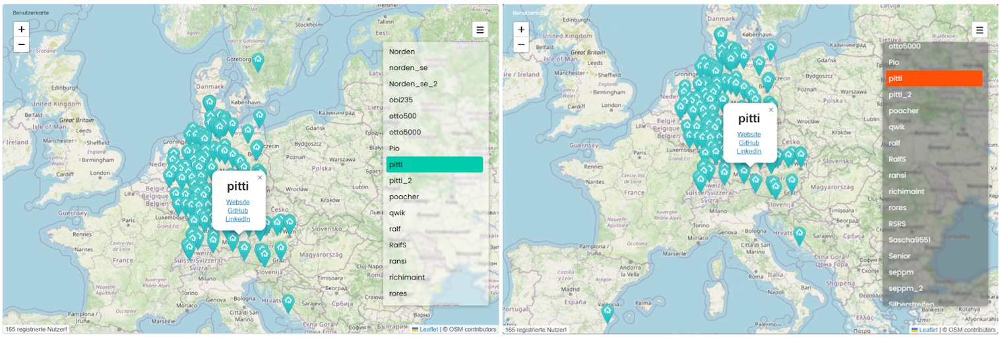

# 🗺️ Benutzerkarte (User Map)

Das Modul bietet die Möglichkeit, jedem Symcon-Benutzer direkt von der Konsole aus seinen eigenen Standortmarker auf eine interaktive Karte (Symcon User Map) hinzuzufügen.  

 

## Inhaltverzeichnis

1. [Funktionsumfang](#user-content-1-funktionsumfang)
2. [Voraussetzungen](#user-content-2-voraussetzungen)
3. [Installation](#user-content-3-installation)
4. [Einrichten der Instanzen in IP-Symcon](#user-content-4-einrichten-der-instanzen-in-ip-symcon)
5. [Statusvariablen und Darstellungen](#user-content-5-statusvariablen-und-darstellungen)
6. [Visualisierung](#user-content-6-visualisierung)
7. [PHP-Befehlsreferenz](#user-content-7-php-befehlsreferenz)
8. [Versionshistorie](#user-content-8-versionshistorie)

### 1. Funktionsumfang

Die Idee für dieses Modul stammt aus dem ehemaligen Symcon-Forum sowie aus dem HomeMatic-Forum. Dort wurde eine ähnliche Lösung bereits auf einfache und pragmatische Weise mit Google Maps umgesetzt. Der Nachteil dieser Variante war jedoch, dass die Standortdaten über Nachrichten zwischen den Systemen ausgetauscht und verwaltet werden mussten.  
Dieser Ansatz kombiniert verschiedene Technologien, um eine moderne, einfache und selbst verwaltbare Lösung für die Verwaltung eigener Standorte bereitzustellen. Ziel ist es, eine flexible Standortdarstellung zu ermöglichen, ohne auf externe Verwaltungsdienste oder komplizierte manuelle Prozesse angewiesen zu sein.

* Auslieferung als schlanker One-Pager über CDN (Netlify) für die externe Website
* Integrierte Unterstützung für die Kachelvisualisierung (Tile-Visu) in Symcon
* Registrieren, Aktualisieren und Löschen der Standortdaten über eine einfache REST-API
* Redaktionelle Möglichkeit, bei Fehlern oder Problemen schnell einzugreifen
* Verwaltung des eigenen Standorts sowie privater Links über das Symcon Modul

### 2. Voraussetzungen

* IP-Symcon ab Version 8.1

### 3. Installation

* Über den Modul Store das Modul __Benutzerkarte (engl. _User Map_) installieren.
* Alternativ Über das Modul-Control folgende URL hinzufügen.  
`https://github.com/Wilkware/UserMap` oder `git://github.com/Wilkware/UserMap.git`

### 4. Einrichten der Instanzen in IP-Symcon

* Unter 'Instanz hinzufügen' ist das _Benutzerkarte_-Modul unter dem Hersteller '(Geräte)' aufgeführt.

__Konfigurationsseite__:

Einstellungsbereich:

> 🙋 Benutzerdaten ...

Name                               | Beschreibung
---------------------------------- | -----------------------------------------------------------------
Benutzername (Forum)               | Eigener Benutzername (Nickname/Spitzname) wie im Forum! Bitte nichts Neues erfinden!!!
Standort (Breitengrad, Längengrad) | Dein gewünschter Standort. Über den KOPIEREN Button können die im System hinterlegten Koordinaten übernommen werden.
Links (nicht verpflichend)         | Wer will kann mehrere Links zu seiner Person mitgeben (Website, Github ...)

_Aktionsbereich:_

> 🗝️ Verwalten Sie Ihren Eintrag über die Schaltflächen ...

Aktion                  | Beschreibung
----------------------- | ---------------------------------
REGISTRIEREN            | Den eigenen Standort freigeben bzw. registrieren
AKTUALISIEREN           | Update der daten, z.B. neuer Standort oder Links. ÄNDERUNG DES NAMENS IST NICHT ERLAUBT!
LÖSCHEN                 | Standort wieder zurücknehmen bzw. öffentlich Löschen!

### 5. Statusvariablen und Darstellungen

Es werden keine zusätzlichen Statusvariablen unf Profile/Darstellungen benötigt.

### 6. Visualisierung

Man kann gesamte Modul (HTML-SDK Support) direkt in der Visualisierung verlinken.

### 7. PHP-Befehlsreferenz

Das Modul stellt keine direkten Funktionsaufrufe zur Verfügung.

### 8. Versionshistorie

v2.0.20260713

* _NEU_: Support für TileVisu (Kachel-Visualisierung)
* _NEU_: Kompatibilität auf IPS 8.1 vereinheitlicht
* _NEU_: Umstellung auf Strict-Modus (IPSModuleStrict)
* _NEU_: Modulversion wird in Quellcodesektion angezeigt
* _FIX_: Modulkonfiguration überarbeitet und vereinheitlicht
* _FIX_: Interne Bibliotheken überarbeitet
* _FIX_: Internes Deployment überarbeitet

v1.0.20231206

* _NEU_: Initialversion

## Entwickler

Seit nunmehr über 10 Jahren fasziniert mich das Thema Haussteuerung. In den letzten Jahren betätige ich mich auch intensiv in der IP-Symcon Community und steuere dort verschiedenste Skript und Module bei. Ihr findet mich dort unter dem Namen @pitti ;-)

## Spenden

Die Software ist für die nicht kommerzielle Nutzung kostenlos, über eine Spende bei Gefallen des Moduls würde ich mich freuen.

## Lizenz

Namensnennung - Nicht-kommerziell - Weitergabe unter gleichen Bedingungen 4.0 International

